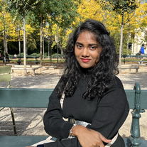

# Group 1

This project involves using a Markdown template repository to create a
collaborative get-to-know-you repository for a study group.

Each member will contribute one markdown file to the repository, and the
emphasis is on fostering group cohesion and practicing collaboration within a
shared repository.

The process includes scheduling a meeting to organize the project and creating
an issue in the class repository with specific labels and details for tracking
progress.

## Contributors

| **[Daria](/members/daria.md)**       | **[Rohma](/members/rohma.md)**   |
| ------------------------------------ | -------------------------------- |
|  |  |

| **[Ramya](/members/sri12334.md)** | **[Richelle](/members/richelle.md)**  |
| --------------------------------- | ------------------------------------- |
|    |  |

## Our objectives

- **Git & GitHub:**

  - Implemented version control with Git.
  - Collaborated efficiently using GitHub.

- **Project Management:**

  - Organized tasks and tracked progress.

- **Problem Solving:**

  - Successfully addressed development challenges.

- **Documentation:**
- 
  - Utilized README files for project information.

- **Skill Development:**
  - Improved teamwork and technical skills.
